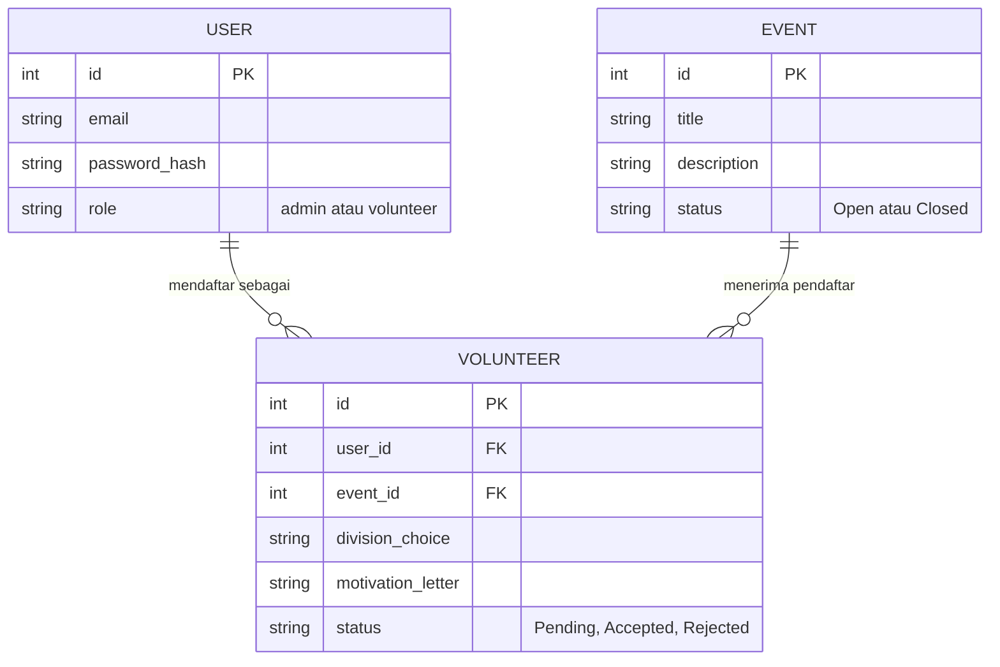

<div align="center">

# 🎓 Volunteer Recruitment System API

[](https://fastapi.tiangolo.com/)
[](https://www.python.org/)
[](https://www.sqlite.org/index.html)
[](https://jwt.io/)

**[📖 Swagger Docs](http://127.0.0.1:8000/docs)** | **[🔴 ReDoc](http://127.0.0.1:8000/redoc)**

API modern, cepat, dan aman untuk mengelola sistem rekrutmen relawan acara kampus. Dilengkapi dengan Frontend Single Page Application (SPA), autentikasi JWT, dan pemisahan akses (Role-Based Access Control) antara Admin (Panitia) dan Relawan.

</div>

---

## ✨ Fitur Utama
* **🔒 Autentikasi Aman:** Autentikasi menggunakan algoritma JWT (JSON Web Token) *stateless* dan *hashing password* via `bcrypt`.
* **🛡️ Role-Based Access (RBAC):** Pemisahan rute bagi Admin (membuat event, mengatur status relawan) dan pengguna biasa (mendaftar relawan).
* **⚡ Sangat Cepat:** Dibangun menggunakan framework **FastAPI** dan mengutamakan validasi skema data tingkat lanjut dari **Pydantic V2**.
* **🧩 Modular & Bersih:** Arsitektur kode mengikuti praktik terbaik (best-practice) pemisahan untuk *routers*, *schemas*, *models*, dan *database dependencies*.
* **💻 Frontend Interaktif:** Terintegrasi langsung dengan antarmuka UI *Glassmorphism* modern menggunakan Tailwind CSS.

---

## 🚀 Mulai Cepat (Quick Start)

### 1. Persyaratan Penginstalan
Pastikan komputer kamu sudah terinstall Python 3.8 ke atas. Buka terminal dan masuk ke direktori folder proyek ini.

### 2. Buat Lingkungan Virtual (Virtual Environment)
Disarankan menggunakan *virtual environment* agak dependensi tidak bertabrakan dengan sistem bawaan.
```bash
python -m venv venv
source venv/bin/activate  # Untuk Mac/Linux
# atau .\venv\Scripts\activate untuk Windows
```

### 3. Instalasi Dependensi
Jalankan file instalasi library yang dibutuhkan:
```bash
pip install -r requirements.txt
```

### 4. Jalankan Server
Gunakan Uvicorn untuk menjalankan server. Database SQLite (`volunteer_recruitment.db`) akan terbuat secara otomatis ketika pertama kali berjalan.
```bash
uvicorn main:app --host 127.0.0.1 --port 8000 --reload
```

### 5. Akses Aplikasi
- **Aplikasi Frontend Utama:** Silahkan buka file `frontend/index.html` pada browsermu, atau akses jika sebelumnya telah dikonfigurasi melalui rute statis.
- **REST API Endpoint:** `http://127.0.0.1:8000`
- **Swagger UI (Interactive Docs):** [http://127.0.0.1:8000/docs](http://127.0.0.1:8000/docs)

---

## 🗄️ Arsitektur Database (ERD)

Struktur tabel hierarkis yang digunakan pada SQLite dikelola menggunakan SQLAlchemy ORM dengan relasi Many-to-Many melalui junction table.



---

## 📖 Referensi Endpoint API

### 🔐 1. Autentikasi
| HTTP Method | Endpoint | Deskripsi | Wajib Login |
| :---: | :--- | :--- | :---: |
| <kbd>POST</kbd> | `/auth/register` | Mendaftarkan akun baru (Admin/Volunteer). | ❌ |
| <kbd>POST</kbd> | `/auth/login` | Autentikasi user dengan email dan password. Mengembalikan akses JWT token. | ❌ |

### 📅 2. Event (Acara)
| HTTP Method | Endpoint | Deskripsi | Wajib Login | Role |
| :---: | :--- | :--- | :---: | :---: |
| <kbd>GET</kbd> | `/events/` | Mengambil seluruh daftar event | ❌ | Semua |
| <kbd>GET</kbd> | `/events/{id}` | Mengambil detail 1 event saja | ❌ | Semua |
| <kbd>POST</kbd> | `/events/` | **[Admin]** Membuat event panitia baru | 🔑 | Admin |
| <kbd>PUT</kbd> | `/events/{id}` | **[Admin]** Mengubah (update) detail event | 🔑 | Admin |
| <kbd>DELETE</kbd>| `/events/{id}` | **[Admin]** Menghapus event secara permanen | 🔑 | Admin |

### ✋ 3. Rekrutmen Relawan (Volunteer)
| HTTP Method | Endpoint | Deskripsi | Wajib Login | Role |
| :---: | :--- | :--- | :---: | :---: |
| <kbd>POST</kbd> | `/volunteers/` | Mendaftar sebagai relawan ke Event acara. | 🔑 | Semua |
| <kbd>GET</kbd> | `/volunteers/my` | Melihat seluruh riwayat pendaftaran diri sendiri | 🔑 | Semua |
| <kbd>GET</kbd> | `/volunteers/event/{id}`| **[Admin]** Melihat semua pendaftar pada suatu event | 🔑 | Admin |
| <kbd>PUT</kbd> | `/volunteers/{id}/status`| **[Admin]** Mengubah status (Accept/Reject) | 🔑 | Admin |
| <kbd>DELETE</kbd>| `/volunteers/{id}` | Membatalkan pendaftaran diri secara permanen | 🔑 | Semua |

---

## 💻 Contoh *Request* (Payloads)

<details>
<summary><b>1. Registrasi Akun Admin</b></summary>

**Request:** `POST /auth/register`
```json
{
  "email": "admin@kampus.ac.id",
  "password": "panitiaroot123",
  "role": "admin"
}
```

**Response:** `201 Created`
```json
{
  "email": "admin@kampus.ac.id",
  "role": "admin",
  "id": 1,
  "is_active": true
}
```
</details>

<details>
<summary><b>2. Membuat Event Kepanitiaan (Admin)</b></summary>

*Wajib melampirkan Header:* `Authorization: Bearer <token_admin>`

**Request:** `POST /events/`
```json
{
  "title": "Kepanitiaan PKKMB Unhas 2026",
  "description": "Rekruitmen seluruh divisi kepanitiaan penerimaan mahasiswa baru tahun ajaran 2026.",
  "status": "Open"
}
```

**Response:** `201 Created`
```json
{
  "title": "Kepanitiaan PKKMB Unhas 2026",
  "description": "Rekruitmen seluruh divisi kepanitiaan penerimaan mahasiswa baru tahun ajaran 2026.",
  "status": "Open",
  "id": 1,
  "created_at": "2026-04-19T10:05:00.000000"
}
```
</details>

<details>
<summary><b>3. Mendaftar Relawan</b></summary>

*Wajib melampirkan Header:* `Authorization: Bearer <token_user>`

**Request:** `POST /volunteers/`
```json
{
  "event_id": 1,
  "division_choice": "Acara",
  "motivation_letter": "Saya memiliki public speaking yang baik dan ingin mensukseskan acara kampus kita!"
}
```

**Response:** `201 Created`
```json
{
  "id": 1,
  "event_id": 1,
  "user_id": 2,
  "division_choice": "Acara",
  "motivation_letter": "Saya memiliki public speaking yang baik dan ingin mensukseskan acara kampus kita!",
  "status": "Pending",
  "created_at": "2026-04-19T10:10:00.000000"
}
```
</details>
